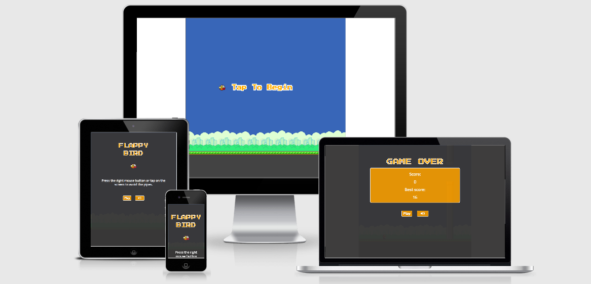

<h1 align="center">Flappy Bird</h1>

The original game Flappy bird, which was first launched in May 2013, is developed by Dong Nguyen. 

The purpose of the game is to make a bird fly while avoiding pipes. The bird is held in the air by tapping on the screen or by pressing the space key on the keyboard. The player gets a point for every pipe that the bird passes. If the bird hits a pipe or the ground, the player is game over. The original Flappy Bird has simple graphics and tubes, which is reminiscent of Super Mario Bros 3. 

This version of the game offers the classic Flappy Bird gameplay (without the medals), a clean interface, and a simple design (which is inspired by the original game). If you enjoy the game by playing it, the game has achieved its purpose! 

**Disclaimer:** The flappy bird game is developed for educational purposes.

This project is the second out of four Milestone Projects in the Full Stack Web Development Program I am attending at The Code Institute. 

**[View the live project here.](https://juanstelling.github.io/MS2_flappy_bird/)**

---

## Index 

- <a href="#ux">1. User experience (UX)</a>
  - <a href="#ux-goals">1.1. Project goals</a>
  - <a href="#ux-stories">1.2 User stories</a>
  - <a href="#ux-design">1.3 Design</a>
  - <a href="#ux-wireframes">1.4 Wireframes</a>
- <a href="#features">2. Features</a>
  - <a href="#features-existing">2.1 Existing features</a>
  - <a href="#features-future">2.2 Features left to implement in the future</a>
- <a href="#technologies">3. Technologies used</a>
- <a href="#testing">4. Testing</a>
- <a href="#deployment">5. Deployment</a>
- <a href="#credits">6. Credits</a>

---

<h1>1. User experience (UX)</h1>

### 1.1 Project goals 

- Making an interactive front-end site. The site should respond to the users’ actions, allowing users to actively engage with data, alter the way the site displays the information to achieve their preferred goals.
- Creating a game that is easy to understand and play. 

### 1.2 User stories 

**As a player I want:**
1. As a player, I want to easily understand the game. 
2. As a player, I want to have access to the instructions of the game. 
3. As a player, I want to play an interactive game that challenges myself to get a high score. 
4. As a player, I want to be able to play the game multiple times.
5. As a player, I want to turn the music on and off. 
6. As a player, I want to play the game on every device and internet browser. 

### 1.3 Design 

- #### Colour scheme 
The colours that are used for the start and game over screen are:
-  #ffab0d (Orange)
-  #ffffff (White)
-  #383737 (Dark grey)

I have chosen these colours because the colours match with the game and the avatar of the game, the bird. The bird itself is a yellow/orange bird. The colours white and dark grey are used to make the orange colour pop out.

The backgroundcolour for the game 
-  #3b6cb5 (Dark Blue)

This colour is chosen for the background of the game. The dark blue represents the sky where the bird flies into. 

- #### Fonts
The **press to start 2p** font and  **play** font are used throughout the whole game. Sans Serif is the fallback in case the main font isn’t being imported to the site correctly. The press to start 2p fonts is used for the titel of the game, the get ready text and the game over text. This font is used because the font gives an old school game vibe. The play font is used for the instructions, the text on the buttons and the scores in the game. The play font is easy to read and matches good with the press start 2p.

- #### Graphics
For the project, I decided to inspire the graphics on the original Flappy Bird. 
- The 'tap to begin' text in the get ready state of the game is made by the developer, Juan Stelling. 
- The bird, the pipes, the buildings and the ground images are by Code Explained on their [Original-Flappy-Bird-Javascript repositry](https://github.com/CodeExplainedRepo/Original-Flappy-bird-JavaScript). The pipes are edited by the developer from the green colour to the grey colour. And the colour of the ground is edited from the sand colour to a grey colour. The changes are done to give the game a nighttime feeling. 

- #### Audio 
For the project, I decided to inspire the audio on the original Flappy Bird. All sounds that are used for the project are from Code Explaines on their [Original-Flappy-Bird-Javascript repositry](https://github.com/CodeExplainedRepo/Original-Flappy-bird-JavaScript).  

### 1.4 Wireframes 
Instead of wireframes, I preferred to make mockups. I used mockups to fleshes out the static visual look of the game. The mockups are made with [Figma.](https://www.figma.com/)

Click on the links below to see the mockups in Figma.
|    Mobile   |    Tablet    |    Desktop   |
|    :----:    |     :----:   |    :----:    |
|[Flappy Bird](https://www.figma.com/file/kGjKyA8CrNuFJ6WkrxcsGn/Flappy-bird?node-id=0%3A1)|[Flappy Bird](https://www.figma.com/file/kGjKyA8CrNuFJ6WkrxcsGn/Flappy-bird?node-id=1%3A2)|[Flappy Bird](https://www.figma.com/file/kGjKyA8CrNuFJ6WkrxcsGn/Flappy-bird?node-id=4%3A643)|

<h1>2. Features</h1>

### 2.1 Existing features 

#### 1. Start screen 
- On the start screen is a short instruction of the game for desktop and mobile/tablet. 
- On the start screen the music can be turned off and on. 
- On the start screen there is a play button to start the game. 

#### 2. Responsive HTML Canvas
- The core game (background, bird and pipes) are made with HTML canvas for the visualization of the game. 
- the canvas is responsive on all devices while preserving its aspect ratio and resolution. 

#### 3. Controlling the game 
- The game can be controlled with the mouse (by clicking on the left mouse button). When the player presses the mouse the bird is flying. 
- the game can be controlled with a touchscreen (by tapping on the screen). When the player touches the screen the bird is flying. 
- The game starts when the player is in the get ready state and presses the left mouse button or taps on the screen. 
- All buttons are clickable.

#### 4. The Game
- Every time the player is passed a pipe and the pipe disappears from the canvas, the score will be +1. 
- When the player hits the pipe or the ground, it is game over. The game over screen will pop up. 

#### 5. Scores
- During the game, the player sees the current score in the canvas.
- On the game over screen the current score and the best score shows on the screen. 
- The best score is saved to the device's local storage. The best score will remain between game sessions. 

#### 4. Sound
- During the game, there are four sounds that interact with the game: 
    - One sound is made when the player clicks on the left mouse button or taps on the screen (sound of the wings). 
    - One sound is made when the pipe is out of the canvas (the player gets a score of +1) (sound of score).
    - One sound is made when the bird hits the pipes (Sound of hit the pipe).
    - One sound is made when the bird hits the ground (sound of dead).

#### Game Over screen 
- The game over screen shows the current score and the best score of the player. 
- The game over screen shows the music button to turn the sound off or on. 
- the game over screen shows the play button. With the button the player can play the game again.

### 2.2 Features left to implement in the future 
- **Different playing backgrounds:** When the player plays the game again, the background is changed. The player plays the game every time with another background. 
- **Choosing the avatar of the game** In the beginning of the game the player can choose an avatar to play with. In the current case the only avatar is the bird. 

<h1>3. Technologies used</h1>

#### Languages used
- [HTML5](https://en.wikipedia.org/wiki/HTML5)
    - HTML5 provides the structure and the content for my project. 
- [CSS3](https://en.wikipedia.org/wiki/Cascading_Style_Sheets)
    - CSS3 provides the style of the HTML5 elements.
- [Javascript](https://en.wikipedia.org/wiki/JavaScript)
 - JavaScript provides the interactivity of the project. 

#### Frameworks, libraries & programs used
- [Gitpod](https://www.gitpod.io/) 
    - The GitPod is used to develop the project.
- [Git](https://git-scm.com/)
    - The Git was used for version control to commit to Git and push to GitHub.
- [GitHub](https://github.com/)
    - The GitHub is used to host the project.
- [Google Fonts](https://fonts.google.com/)
    - Google Fonts is used to provide the font roboto for all the text that is used in the project. 
- [Figma](https://www.figma.com/)
    - Figma is used to create the mockup designs for the project.

#### Testingtools used 
- [Autoprefixer](https://autoprefixer.github.io/)
    - Autoprefixer is used to parsethe CSS and to add vendor prefixes to CSS rules. 
- [W3C Markup Validation Service](https://validator.w3.org/)
    - The W3C MarkUp Validation Service is used to check whether there were any errors in the HTML5 code. 
- [W3C CSS validator](https://jigsaw.w3.org/css-validator/)
    - The W3C CSS validator is used to check whether there were any errors in the CSS3 code.
- [JShint](https://jshint.com/)
- JShint is a JavaScript validator dat is used to check wheter there were any errors in the JavaScript code. 

<h1>4. Testing</h1>

The testing process can be found [here](URL....).

<h1>5. Deployment</h1>

#### Deployment of my project 
This project is hosted in GitHub pages, to make my project visible to others. 

The project is deployed via the following steps:
1. Log in to GitHub and go to the repository.
2. At the top of the repository, locate the **Settings** button and click on it. 
3. On the Settings page, scroll down to the **GitHub Pages**  section.
4. Select **Master Branche** by the source section. 
5. The page refreshes automatically. 
6. Scroll down to the GitHub Page section and the link of the website is standing in the green bar.

#### Clone my project 
To make a local clone and deploy this project in your GitHub Desktop, follow the following steps. 

To clone this project from GitHub: 
1. Log in to GitHub and go to the repository. 
2. Click on the green button with the text **“Code”.**
3. Click on **“Open with GitHub Desktop”** and follow the prompts in the GitHub Desktop Application or follow the instructions from **[this link](https://docs.github.com/en/free-pro-team@latest/github/creating-cloning-and-archiving-repositories/cloning-a-repository#cloning-a-repository-to-github-desktop)** to see how to clone the repository in other ways. 

<h1>6. Credits</h1>

#### Content 
- All text within the game is original content.
- The developer took inspiration of several tutorials. 

**Tutorials**
- [Create The Original Flappy Bird Game Using JavaScript and HTML5 canvas](https://youtu.be/0ArCFchlTq4)
- [We make FLAPPY BIRD + DEPLOY it on IPFS in 1min! Built in JavaScript, HTML and CSS (No Canvas!)](https://youtu.be/gxHcW84izz0)
- [The Easiest Flappy Bird Tutorial Ever? - Beginner Javascript Game](https://youtu.be/3SsYZDJdeXk)
- [JavaScript - Snake - 46 Setting the Visibility of the Game Over Menu](https://youtu.be/dTevI-K-DPQ)
- [JavaScript - Snake - 55 Updating the Scoreboard Text](https://youtu.be/Y7DAZyUOWuU)
- [JS Asteroids Game Part 7 (Sound Effects and “Music”)](https://youtu.be/LfSBbrGqFV0)
- [Audio Play Pause and Stop using JavaScript | Play Audio using JavaScript](https://youtu.be/wffK2OIt8u0)

#### Media & Audio 
- The bird, the pipes, the buildings and the ground images are from Code Explained on their [Original-Flappy-Bird-Javascript repositry](https://github.com/CodeExplainedRepo/Original-Flappy-bird-JavaScript). The original pipes and gound are edited by the developer to another colour.
- The sounds that are used for the project are from Code Explained on their [Original-Flappy-Bird-Javascript repositry](https://github.com/CodeExplainedRepo/Original-Flappy-bird-JavaScript).  

#### Acknowledgement 
Thanks to the following people or organizations who helped or inspired me for the project.  
- The support and guidance of my mentor Precious Ijege. 
- The lessons and knowledge of [Code Institute.](https://codeinstitute.net/)
