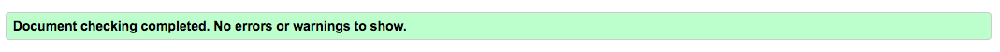
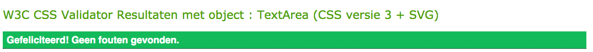

<h1 align="center">Testing</h1>

## Code validators
**[HTML Validator](https://validator.w3.org/):** No errors or warnings to show.

**[CSS Validator](https://jigsaw.w3.org/css-validator/):** No errors found.

**[JS Hint](https://jshint.com/):** No errors found, 32 warnings

- 21 warnings consist the notification: 'const' is available in ES6 (use 'esversion: 6') or Mozilla JS extensions (use moz).
- 10 warnings consist the notification: 'let' is available in ES6 (use 'esversion: 6') or Mozilla JS extensions (use moz).
- 1 warning consist the notification: Redefinition of 'frames'.

---
## Responsiveness 
- Responsiveness of the game is tested with [Chrome DevTools](https://developers.google.com/web/tools/chrome-devtools) and [Responsive Design Checker](https://www.responsivedesignchecker.com/).
- The game is tested on the following devices: 
    - Desktop: 1024px, 1366px, 1440px, 1600px and 1680px. 
    - Mobile & Tablet: Galaxy S5, iPhone 5/SE, iPhone 6/7/8, iPhone 6/7/8 plus, iPhone x, iPad and  iPad Pro

### Notes
- The max width of the canvas is set to 786px, this means that the canvas on the desktop version doesn't cover the whole screen. There is white space on the side of the canvas. This is done on purpose to keep the game compact and organized. 

---