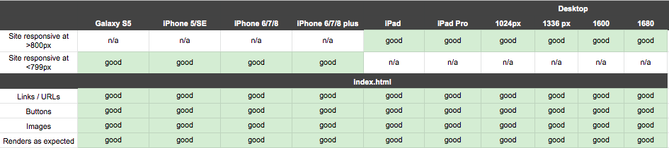

<h1 align="center">Testing</h1>

## Code validators
**[HTML Validator](https://validator.w3.org/):** No errors or warnings to show.

**[CSS Validator](https://jigsaw.w3.org/css-validator/):** No errors found.

**[JS Hint](https://jshint.com/):** No errors found, 32 warnings

- 21 warnings consist the notification: 'const' is available in ES6 (use 'esversion: 6') or Mozilla JS extensions (use moz).
- 10 warnings consist the notification: 'let' is available in ES6 (use 'esversion: 6') or Mozilla JS extensions (use moz).
- 1 warning consist the notification: Redefinition of 'frames'.

---
## Responsiveness 
- Responsiveness of the game is tested with [Chrome DevTools](https://developers.google.com/web/tools/chrome-devtools) and [Responsive Design Checker](https://www.responsivedesignchecker.com/).
- The game is tested on the following devices: 
    - Desktop: 1024px, 1366px, 1440px, 1600px and 1680px. 
    - Mobile & Tablet: Galaxy S5, iPhone 5/SE, iPhone 6/7/8, iPhone 6/7/8 plus, iPhone x, iPad and  iPad Pro

### Notes
- The max width of the canvas is set to 786px, this means that the canvas on the desktop version doesn't cover the whole screen. There is white space on the side of the canvas. This is done on purpose to keep the game compact and organized. 

---
## Browser compatibility

### Notes 

--- 
## Testing user stories 

### As a player I want | Tested by the developer 
1. As a player, I want to easily understand the game.
    -  The player starts with the start screen. On the start screen the player will see an instruction of how the game is played. When the player plays the game for the first time it takes some getting to used to, but when the player plays the game for the second time the player knows what to do and how to play the game easily.   
2. As a player, I want to have access to the instructions of the game.
    - The playes sees the instructions of the game in the start screen. The player presses the left mouse button (for desktop) or taps on the screen (for mobile) to control the bird. The instructions say to avoid the pipes. The bird has to avoid the pipes and have to fly in the gaps to have a score of +1.
3. As a player, I want to play an interactive game that challenges myself to get a higher score.
    - When the game is game over, the player sees the current score and the best score of the player. When the player sees the best score, he/she wants to get a higher score to beat his/her own best score. 
4. As a player, I want to be able to play the game multiple times.
    - When the game is game over, the player can press on the play button to play the game multiple times. The player can also press on the home button where the player sees the start screen. From the start screen the player can also play the game again. 
5. As a player, I want to turn the music on and off.
    - The player can turn the music on and off at the start screen or the game over screen with the sound button.   
6. As a player, I want to play the game on every device and internet browser.
    - The player can play the game on desktop, tablet and mobile. The player can also play the game on multiple internet browsers.

### As a player I want | Tested by respondents
**The user stories of the game are also tested by three friends of the developer, the results are below**

---
## Bugs
1.  A bug was found in drawing the tap to begin text in the canvas (in the get ready state of the game). **The image didn't appear on the canvas.**
    - The meaning of the w and h in the const getReady means the width and hight of the image in the canvas. The width and height were not good, thats why the image with the text 'Tap To Begin' didn't appear. The bug was fixed to experiment with the width and height of the image to make the image completely visible on the canvas.
2. A bug was found in the sound button. **The sound effects of the game didn't respons** on the play and pause audio element.
    - The sound effect didn't pause when the pause audio element was used because the sound effect wasn't a sound that played all the time, but only when something happend. This bug was fixed by using the volume element. The volume is 0 (off) when the player hits the sound button and when the player presses the sound button again the volume is 1 (on).
3. A bug was found in responsive design for iPhone 5/SE. **The start screen and game over screen didn't fully appear** in the screen of the iPhone 5/SE.
    - The buttons of the start and game over screen didn't fully show in the screen. This bug was fixes by setting a media querie specially for the iPhone 5/SE.
4. A bug was found in showing the game over screen when the bird hits a pipe (game over). **The game over screen didn't appear.**
    - The game over screen was called by endscreen.style.visibility="visible"; but the game over screen didn't appear. The bug was fixed by using a function and puting the endscreen.style.visibility="visible"; inside that function. In the if statement of game over the function is called instead of endscreen.style.visibility="visible";.
5. A bug was found with the bird. **The bird was already flapping when the bird was in the get ready state, but the bird had to be fixed.**
    - The flapping of the bird was set at 5, which means that the bird was flapping slowly in the get ready state. The bug was fixed by changing the 5 to 0. The 0 means that the bird is fixed at the get ready state. 
---
[Go to README.md file](README.md).